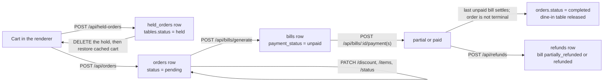

# Order lifecycle

An order is the server's record of a sale in progress. The renderer collects choices - cart lines, a
table, a discount, a tender - and submits them; the API resolves prices, tax, discounts, balances,
and settlement, and the renderer reads the result back. What a customer owes is never decided in the
renderer; the reasoning is in
[0002: backend-authoritative security and tax](../decisions/0002-backend-authoritative-security-and-tax.md).



The endpoint tables, authorization gates, and rate limits are in the
[API reference](../reference/api.md); this page explains how the stages fit together and where each
boundary fails.

## Cart and held carts

A held cart is a snapshot of the renderer's cart, not an order. `POST /api/held-orders` stores it in
`held_orders` and marks the table `held`; nothing is priced, stock is not touched, and no kitchen
ticket exists. A table holds at most one cart: posting again for the same table replaces the stored
row, returning a new `ho-` id.

The POS resume path is [`frontend/src/store/held-orders.ts`](../../frontend/src/store/held-orders.ts)
plus the POS page at `frontend/src/app/(dashboard)/pos/page.tsx`: the store deletes the persisted
hold before returning its cached cart, which the page then loads into the renderer for checkout.
Order creation happens later. If checkout or order creation fails after the restore, the hold is
already gone and the cart remains only in renderer memory. The held-order API reference describes
the delete guard and table update.

Cart decisions travel with the hold as ids (`waivedChargeIds`, `optedInChargeIds`) and are handed to
the charges engine when the order is created, which stays authoritative about which of them apply.

## Creating the order

`POST /api/orders` in [`main/routes/orders.ts`](../../main/routes/orders.ts) is the pricing entry
point. It requires 1 to 200 items and a `type` of `dine_in`, `takeaway`, `delivery`, or `online`, and
accepts a table, customer, guest count, notes, manual charge amounts, cart charge choices, and the
delivery-only fields documented in the API reference.

Everything monetary is resolved server-side inside one transaction:

- The unit price comes from the catalog: `products.price`, or the variant price for an order with an
  `online_platform`. A client-sent price is never read.
- Quantity rules are checked per sale unit, including fractional and weight-precision products.
- Stock deduction and recipe depletion are written in the same transaction, so the order and its
  inventory effects commit together.
- Each line's tax is computed by the tax engine ([Taxation](taxation.md)) and stored on the line as
  `tax_amount`, `tax_breakdown`, `tax_snapshot`, and `tax_type`.
- The charges engine decides which configured charges apply, honouring the cart's waived and
  opted-in ids. Standard ids are projected onto the order's `packaging_charge` and `service_charge`
  columns; non-standard charges are added to the total. The snapshot rules are in
  [product invariants](../reference/product-invariants.md#applied-charge-snapshots-stay-with-existing-orders).
- The total is the discounted subtotal plus exclusive tax plus delivery, packaging, service, and
  other charges, rounded to the currency's decimal places. A total whose minor-unit
  value would leave the safe-integer range is rejected instead of being stored lossily.

Order numbers are allocated inside the transaction. Request replay follows the
[order API idempotency contract](../reference/api.md#orders).
The order starts `pending` with its totals snapshotted, and a `dine_in` order with a table marks the
table `occupied`.

## Discounts

Three surfaces apply discounts, all gated by the discount permission for their scope and by the same
settings:

| Surface | Endpoint | Notes |
| --- | --- | --- |
| Order | `PATCH /api/orders/:id/discount` | Percentage or flat amount against the item subtotal; split bills return `409`, and completed or cancelled orders return `400`. |
| Order item | `PATCH /api/orders/:id/items/:itemId/discount` | One line; split or refunded bills return `409`, and completed or cancelled orders or cancelled, voided, void-adjustment, or refunded items return `400`. |
| Bill | `POST /api/bills/:id/applyDiscount` | Recomputes the bill and order; paid bills return `400`, split or refunded bills and cancelled orders return `409`. A completed order can still be discounted while its bill is unpaid. |

Common rules, enforced in the handlers:

- `discount_mode` selects what is allowed (`percentage` by default; `none` disables discounts, `flat`
  rejects percentage discounts and vice versa).
- `discount_max_percentage` (default 25) and `discount_max_amount` (`0` means no limit) cap the
  value. A discount above the cap is a `400`.
- `discount_requires_approval` requires a manager PIN, and the approving user must itself hold the
  discount permission.
- A percentage discount applies to the fresh item subtotal, and a flat discount is capped at that
  subtotal. Re-applying a discount never compounds on the previous one.
- The discount rescales each line's tax by the discounted share of the subtotal and rounds to the
  currency, so tax is charged on the discounted amount.
- Applying a discount to an order that has an unpaid bill re-syncs the bill's totals and balance.
  A zero `discount_value` clears an order discount, and a zero `value` clears a bill discount,
  subject to the bill endpoint's discount-mode checks. The item endpoint requires a positive
  `discount_value`.

## Bills

`POST /api/bills/generate` creates the order's bill, or, when a bill already exists and is not paid,
re-syncs its totals, discount, and charges from the order and recomputes `balance` against
`paid_amount`. A paid bill is never rewritten. Bills snapshot subtotal, discount, tax, charges,
`total`, `paid_amount`, `balance`, and `payment_status`; payable rounding may add a `round_off`
adjustment for packs that define one.

A split order can have multiple bills, each with its own payments and balance. An order completes
only once every bill of the order is settled; the API reference documents split eligibility and
limits.

## Payments

`POST /api/bills/:id/payment` takes one payment line; `POST /api/bills/:id/payments` takes up to 100
lines and applies them in a single transaction. Both require the payment permission and read the
same fields:

- `method`: `cash`, `card`, `wallet`, or an active configured method, resolved by name or explicitly
  as `{ method: 'custom', payment_method_id }`. An inactive or unknown method is a `400`.
- `amount`: a number in major units with no more decimal places than the currency allows. A
  single-line payment may omit it to settle the remaining balance; a multi-line batch requires every
  amount.
- `transaction_id`: an external reference scoped to its payment method. Reusing it on another bill is
  a `409`; repeating it for the same method twice in a new multi-line batch is also a `409`, while
  reusing it across methods in that batch is a `400`. Replaying an identical committed payment
  returns the bill without writing again.
- `notes` (up to 1024 UTF-16 code units); serialized payment-line JSON is limited to 8192 UTF-16
  code units.
- `customer_id`: if neither the bill nor order has a customer, a non-wallet payment may attach one;
  if either already has an associated customer, a different id is a `400`. Wallet payments require a
  customer already associated with the bill or order, with enough points.
- `override_pin`: the manager override described below.

Non-cash lines can never exceed the balance (`400`). Cash is applied up to the amount still owed and
the difference is recorded as change, so an over-tendered bill settles and its ledger line carries
`tendered_amount` and `change_amount`.

The optional `Idempotency-Key` is actor-scoped: the same key with the same normalized request
returns the committed response, and the same key with a different request is a `409`.

Two gates sit between a valid request and the write:

- **Shift gate.** When `require_open_shift` is on, a cash tender (including a custom method that
  resolves to cash) needs an open shift, or the request is a `409`. The check runs after replay
  detection, so a committed payment can be re-read with the same key after its shift closed. A cash
  ledger line records the open `cash_session_id`.
- **Kitchen-delivery gate.** When `require_kitchen_delivered_before_settlement` is on, `kds_enabled`
  is not `false`, and `billing_type` is not `prepaid`, paying while kitchen items are undelivered
  is a `409` with code `KITCHEN_ITEMS_UNDELIVERED` unless a manager PIN is supplied as `override_pin`.
  The override is recorded in the order audit log.

A paid bill refuses further payment (`400`) and a refunded bill refuses it with `409`. The response
carries the updated bill plus the wallet and loyalty effects; `bill.payment_details` is the
settlement ledger, one entry per line with the applied amount, the requested amount, cash tendered
and change, the `cash_session_id`, and the timestamp.

## Settlement and completion

A bill moves `unpaid` to `partial` to `paid`; refunds move it to `partially_refunded` or `refunded`.
When a payment settles the last unpaid bill of an order, the order becomes `completed` (unless it was
already completed or cancelled) and its dine-in table is released to `available`. A payment never
resurrects a terminal order.

Wallet lines debit the customer's loyalty ledger. A paid bill credits cashback when loyalty is
enabled, excluding the share funded by wallet points.

## Order status

`PATCH /api/orders/:id/status` advances the order through preparation, service, and terminal
statuses. Its allowed transitions, no-op rule, and cancellation approval requirements are in the
[API reference](../reference/api.md#orders). Kitchen item status is a separate surface
(`/api/order-items`); see [order-item status](../reference/api.md#order-item-status).

## Refunds

`POST /api/refunds` reverses part or all of a paid bill. Cash refunds follow the same shift gate as
cash payments. Refund approval tiers, cutoff, and store-credit requirements are in
[product invariants](../reference/product-invariants.md#refunds-and-staff-approval-pins).

## Failure behaviour

All of the stages above run against the local SQLite database, so the whole lifecycle works offline.
Duplicate submissions are guarded by the `Idempotency-Key` header (orders, payments, refunds),
`transaction_id` uniqueness, and the database's own constraints. Mutations that update order,
held-order, bill, payment, or refund state use `withTxn` for their database writes. Bill
print-status updates run outside this transaction. A failure in a wrapped mutation rolls back its
database writes, so it leaves no partial order, bill, or ledger line behind. A closed business day
does not block new orders or new payments; it blocks cash-drawer
movements, and refunds have their own end-of-business-day cutoff described above.

## Verification

```sh
npm run test:integration-order-hold-payment   # hold, discount, tax, installments, gates, replay
npm run test:integration-happy                # order to payment, discount recalculated
npm run test:integration-payments             # payment methods and split lines
npm run test:integration-discount             # discount edge cases
npm run test:integration-tax                  # tax extraction and rounding
npm run test:held-orders                      # held-cart API and store
npm run test:cash-sessions                    # shift gate
npm run test:refunds                          # refund window and approvals
```
